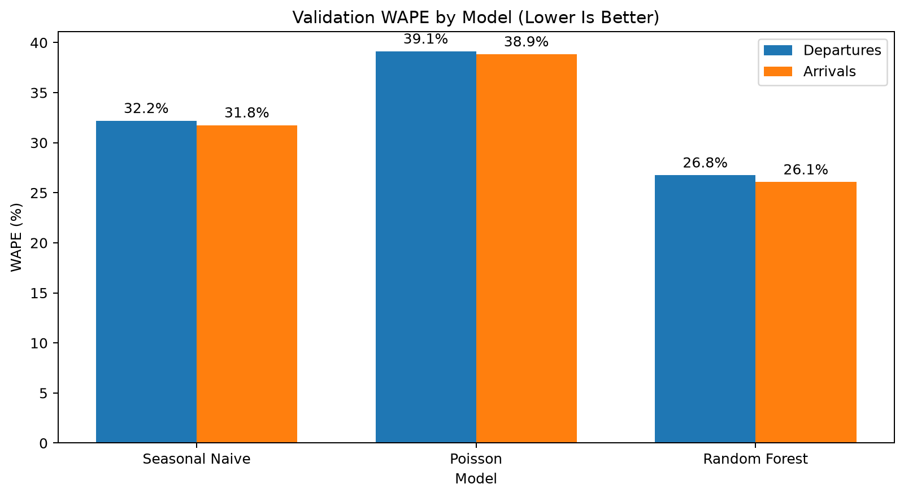
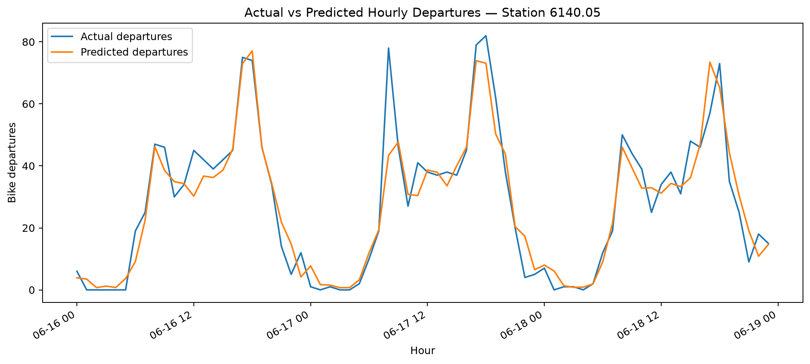
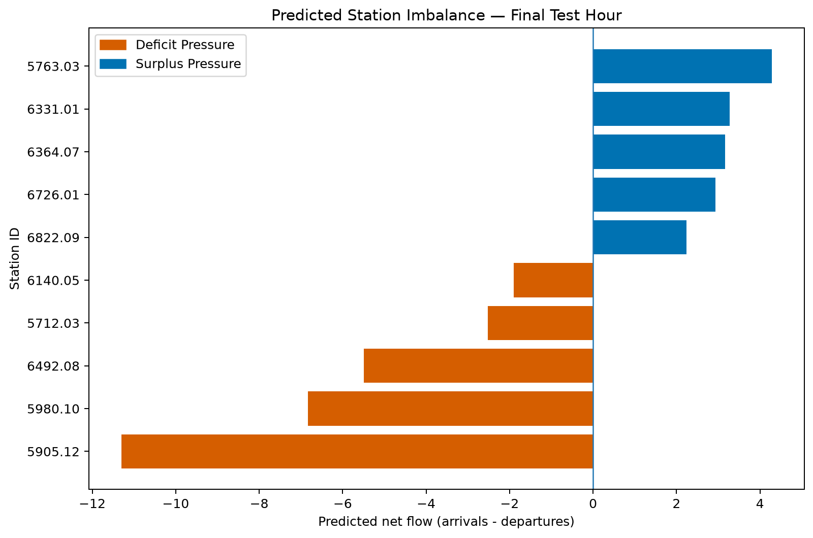
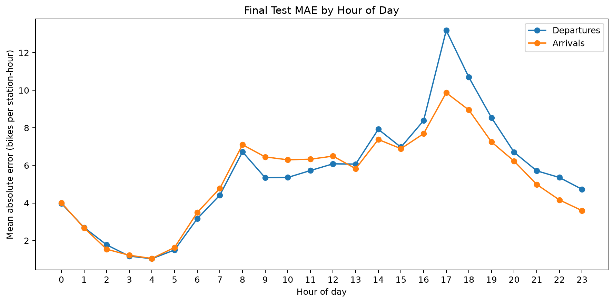

# Bike Share Demand Forecasting and Station Imbalance Prioritization

Hourly departure and arrival forecasts for high-activity Citi Bike stations, with a station-level signal for identifying forecast imbalances.

## Contents

- [Overview](#overview)
- [Key results](#key-results)
- [Data](#data)
- [Workflow](#workflow)
- [Models and results](#models-and-results)
- [What the results mean](#what-the-results-mean)
- [Station-imbalance signal](#station-imbalance-signal)
- [Error analysis](#error-analysis)
- [Repository structure](#repository-structure)
- [Local setup](#local-setup)
- [Limitations](#limitations)
- [Future work](#future-work)
- [Related work](#related-work)

## Overview

Bike-share demand varies by station, hour, and day of week. A station can experience shortage pressure when predicted departures exceed predicted arrivals, or surplus pressure when predicted arrivals exceed predicted departures.

This project builds a reproducible forecasting workflow that:

1. Loads official Citi Bike trip-history files into PostgreSQL.
2. Aggregates trips into a complete station-hour demand table.
3. Selects 20 high-activity stations using training-period data only.
4. Creates past-only calendar, lag, and rolling-demand features.
5. Compares Seasonal Naive, Poisson Regression, and Random Forest models on a chronological validation period.
6. Retrains the selected model on training and validation data.
7. Evaluates once on an untouched test period.
8. Converts predicted net flow into an hourly station-imbalance priority signal.

The project does not estimate real-time inventory or produce truck-routing and dispatch decisions.

## Key results

- Processed 13,939,717 Citi Bike trip rows and loaded 13,939,205 unique trips.
- Built 43,680 station-hour observations across 20 high-activity stations.
- Random Forest achieved final-test MAE of 5.55 departures and 5.25 arrivals per station-hour.
- Final-test WAPE was 27.67% for departures and 27.29% for arrivals.
- Generated 7,200 station-hour imbalance priorities across 360 test hours.
- All 13 automated tests pass.

## Data

Source: [Citi Bike system data](https://citibikenyc.com/system-data)

The analysis uses official New York City trip-history data for April, May, and June 2026.

| Item | Value |
|---|---:|
| Source ZIP files | 3 |
| Source CSV files | 15 |
| Raw trip rows read | 13,939,717 |
| Unique trips loaded | 13,939,205 |
| Duplicate `ride_id` rows skipped | 512 |
| Selected stations | 20 |
| Analysis days | 91 |
| Station-hour rows | 43,680 |
| Zero-activity station-hours | 2,476 (5.67%) |

Zero-demand hours are retained because they represent valid station behavior, not missing observations. Raw files and generated processed data are excluded from Git.

## Workflow

```text
Official Citi Bike ZIP files
    -> chunked validation and PostgreSQL COPY ingestion
    -> training-only top-station selection
    -> complete station-hour aggregation
    -> past-only feature engineering
    -> chronological train/validation/test split
    -> validation-only model comparison
    -> final train + validation retraining
    -> untouched test evaluation
    -> station-imbalance prioritization
    -> diagnostic error analysis
```

### Ingestion and aggregation

The loader processes three explicitly named monthly ZIP files in April-to-June order. CSV data is streamed in 250,000-row chunks and copied through a temporary PostgreSQL staging table. Duplicate ride identifiers are skipped with `ON CONFLICT (ride_id) DO NOTHING`.

Secondary indexes are removed during a full bulk load and restored afterward. Failure cleanup also attempts to restore them before propagating the original ingestion error.

The SQL aggregation creates every selected station-hour combination, then fills missing departure and arrival counts with zero. Stations are selected using April and May activity only, preventing June demand from influencing station selection.

### Features

Separate departure and arrival models use:

- `station_id`
- hour of day
- day of week
- 1-hour lag
- 24-hour lag
- 168-hour lag
- 24-hour rolling mean
- 168-hour rolling mean

Rolling means are shifted by one hour before calculation. The current target therefore cannot enter its own predictors. The first 168 hours for each station provide historical context and are removed from the ML-ready dataset.

### Forecast interpretation

Evaluation is rolling one-hour-ahead, not recursive multi-day forecasting. For each validation or test row, lag features may use earlier observed station demand because those observations would already be available when forecasting the next hour.

Time periods remain fixed and chronological:

| Split | Period | Rows |
|---|---|---:|
| Train | 2026-04-08 00:00 through 2026-05-31 23:00 | 25,920 |
| Validation | 2026-06-01 00:00 through 2026-06-15 23:00 | 7,200 |
| Test | 2026-06-16 00:00 through 2026-06-30 23:00 | 7,200 |

No random train/test split is used.

## Models and results

Three models are compared on validation data:

- Seasonal Naive: demand from the same station and hour one week earlier.
- Poisson Regression: a count-oriented statistical benchmark.
- Random Forest: a nonlinear model using station, calendar, lag, and rolling features.

Lower values indicate better forecasts.

### Validation results

| Model | Target | MAE | RMSE | WAPE |
|---|---|---:|---:|---:|
| Seasonal Naive | Departures | 6.815 | 10.880 | 32.202% |
| Seasonal Naive | Arrivals | 6.467 | 10.287 | 31.760% |
| Poisson Regression | Departures | 8.284 | 23.866 | 39.139% |
| Poisson Regression | Arrivals | 7.911 | 17.008 | 38.854% |
| Random Forest | Departures | 5.664 | 8.867 | 26.763% |
| Random Forest | Arrivals | 5.310 | 8.216 | 26.076% |

Random Forest was selected using validation results only.



### Final test results

After model selection, Random Forest was retrained on 33,120 training and validation rows covering 2026-04-08 through 2026-06-15.

| Target | MAE | RMSE | WAPE |
|---|---:|---:|---:|
| Departures | 5.552 | 8.317 | 27.671% |
| Arrivals | 5.246 | 7.731 | 27.293% |

The test period was not used for model selection or hyperparameter changes.



## What the results mean

On validation data, Random Forest reduced WAPE by 16.9% for departures and 17.9% for arrivals relative to Seasonal Naive. Relative to Poisson Regression, the reductions were 31.6% and 32.9%.

On the final test period, average absolute error was 5.55 departures and 5.25 arrivals per station-hour. WAPE remained close to 27% for both targets, so the forecasts are useful but not exact. The remaining error can still matter at smaller stations and during busy periods.

The forecasts are suitable for ranking stations that may need operational attention. They are not precise enough to support automatic truck dispatch or inventory decisions without live station data, capacity constraints, and routing information.

## Station-imbalance signal

Predicted station net flow is calculated as:

```text
predicted_net_flow = predicted_arrivals - predicted_departures
```

Interpretation:

- Negative net flow: `DEFICIT_PRESSURE`
- Positive net flow: `SURPLUS_PRESSURE`
- Zero net flow: `BALANCED`

`priority_score` is the absolute predicted net flow. Stations are ranked independently within each hour, with rank 1 representing the largest forecast imbalance.

This output prioritizes operational attention. It is not an optimized dispatch recommendation because the project does not include live station inventory, dock capacity, vehicle capacity, routing constraints, or operating costs.



## Error analysis

Final-test absolute errors are grouped by hour of day to show when forecasts are more or less accurate. This analysis is diagnostic only and was not used to retune the selected model.

Both targets were hardest to predict at hour 17. Mean absolute error at that hour was 13.19 departures and 9.87 arrivals per station-hour, compared with overall test MAE of 5.55 and 5.25. This indicates that the evening demand peak remains a difficult period for the current model.



## Repository structure

```text
bike-share-demand-forecasting/
|-- data/
|   |-- raw/                 # Local Citi Bike ZIP files; ignored by Git
|   `-- processed/           # Generated predictions; ignored by Git
|-- notebooks/
|   `-- 01_eda.ipynb         # Raw-sample and station-hour EDA
|-- outputs/
|   `-- figures/             # Versioned final figures
|-- scripts/
|   |-- load_trips.py        # Chunked PostgreSQL ingestion
|   |-- run_pipeline.py      # Training, evaluation, and prediction workflow
|   `-- generate_figures.py  # Figure generation
|-- sql/
|   |-- schema.sql           # Raw trip schema and indexes
|   `-- hourly_demand.sql    # Top-station and station-hour aggregation
|-- src/
|   |-- data.py              # Database connection and data loading
|   |-- evaluate.py          # MAE, RMSE, and WAPE
|   |-- features.py          # Past-only feature engineering
|   |-- models.py            # Splits, baselines, and model pipelines
|   `-- rebalancing.py       # Station-imbalance priorities
|-- tests/                   # Focused unit tests
|-- .env.example
|-- requirements.txt
`-- README.md
```

## Local setup

### Prerequisites

- Python 3.14 or a compatible Python version supported by the pinned dependencies
- PostgreSQL
- `psql` for running the SQL files from a terminal

The verified local environment used Python 3.14.5.

### 1. Create and activate a virtual environment

PowerShell:

```powershell
python -m venv .venv
.\.venv\Scripts\Activate.ps1
python -m pip install --upgrade pip
python -m pip install -r requirements.txt
```

### 2. Configure PostgreSQL

Create a PostgreSQL database named `bike_share` and a project role with permission to create and modify tables and indexes in that database.

Copy `.env.example` to `.env`, then replace the placeholder password locally:

```powershell
Copy-Item .env.example .env
```

`.env` is excluded from Git. Do not commit credentials.

Create the raw trip schema:

```powershell
psql -h localhost -U portfolio_user -d bike_share -f sql/schema.sql
```

### 3. Download source data

Place these files in `data/raw/`:

```text
202604-citibike-tripdata.zip
202605-citibike-tripdata.zip
202606-citibike-tripdata.zip
```

### 4. Load trips

Run a rollback-only smoke test first:

```powershell
python -m scripts.load_trips --smoke-test
```

Run the complete one-time ingestion only when PostgreSQL and all three ZIP files are ready:

```powershell
python -m scripts.load_trips
```

The full load processes approximately 14 million rows and can take substantial time.

### 5. Build station-hour demand

```powershell
psql -h localhost -U portfolio_user -d bike_share -f sql/hourly_demand.sql
```

This SQL file recreates `top_stations_train` and `station_hourly_demand` from the loaded trips.

### 6. Run modeling pipeline

```powershell
python -m scripts.run_pipeline
```

Generated local outputs:

- `outputs/model_metrics.csv`
- `data/processed/rebalancing_predictions.csv`

### 7. Generate figures

```powershell
python -m scripts.generate_figures
```

### 8. Run tests

```powershell
python -m compileall -q src scripts tests
python -m pytest -v
python -m pip check
```

## Exploratory analysis

`notebooks/01_eda.ipynb` inspects a 100,000-row raw-data sample and the complete PostgreSQL station-hour table. Modeling remains in `scripts/run_pipeline.py` so training and evaluation can be rerun outside the notebook.

## Limitations

- Analysis covers three months and 20 high-activity stations.
- Weather, events, holidays, and service disruptions are not modeled.
- Station selection is fixed from the training period.
- Forecasts are evaluated one hour ahead using earlier observed demand, not recursively over multiple days.
- Error analysis uses the final test predictions only and does not alter model selection.
- Imbalance direction does not represent actual station inventory or an optimized rebalancing route.

## Future work

A future V2 could extend the project with:

- A longer demand history covering multiple seasons.
- Weather, holiday, and event features available at forecast time.
- Rolling-origin backtesting across several time periods.
- Gradient-boosting and sequence-model benchmarks, including an RNN when sufficient historical depth is available.
- Prediction intervals or probabilistic demand forecasts.
- Station capacity and live inventory data.
- Rebalancing optimization using vehicle capacity, routing constraints, and operating costs.

These extensions would require a new validation design and a completely unseen final holdout period. The current test set would not be reused for model selection.

## Related work

Related work reviewed: [Variational Poisson RNN](https://github.com/DanieleGammelli/variational-poisson-rnn).

This project does not implement or reproduce VP-RNN or MOVP-RNN. It uses an independent ingestion pipeline, feature-engineering process, classical forecasting models, chronological evaluation design, and station-imbalance prioritization signal.
